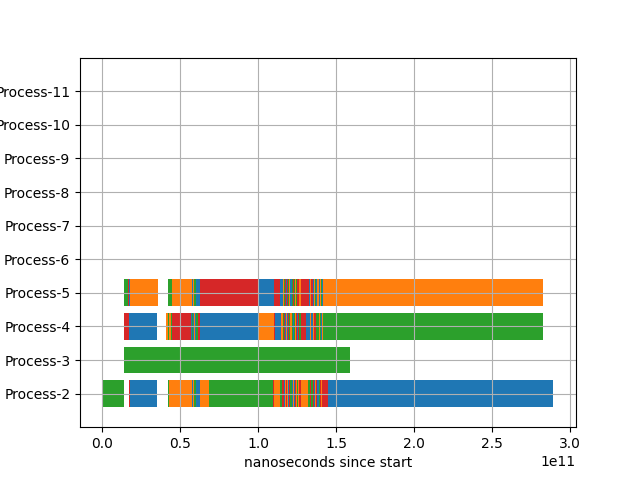

# Performance analysis

Bang's performance can be improved in several ways:

* parallellism
* reduce false positives
* make parsers faster

Analyse the performance before you improve. This directory contains some tools that can measure bang's performance aspects.

## Parallellism

Bang uses Python's `multiprocessing` module. Running `bang` with the `-v` option will log the start and end times of every job.
The script `thread_perf_plot.py` will plot the duration of each job. You must install the `matplotlib` module.

Run `bang` with the `-v` option:

```
bang scan -v -j 4 -t tmp/bangtest2/ -u tmp/bangtest2/ test/testdata/download/filesystem/gpt_partition_table/OPNsense-21.7.1-OpenSSL-vga-amd64.img > log-multiprocessing 2>&1
```

Then run `thread_perf_plot.py`:

```
python thread_perf_plot.py < log-multiprocessing
```

A plot window should pop up after a while, showing something like the following:



Every job has a different color. This plot shows you how well the jobs are divided over the multiple processes. Note that the times are wall clock time, therefore this plot
only really shows whether processes have to wait for new jobs, not how efficient each job is.

## Reduce false positives

Before trying to see whether a parser can be made more efficient, it might pay off to see how often it runs unnecessarily.
Preventing unnecessary work might save more time, especially if the parsers is invoked often.
To see how often a parser is invoked, run the `parser_stats.py` script.
Similar to the thread performance analysis, run `bang` with the `-v` option. Then run `parser_stats.py` on the log file. Using the
example from the thread performance analysis, this would be:

```
python parser_stats.py < log-multiprocessing
```

You can find an example output [here](parser-stats-example.txt).

The output has 8 columns:

```
Success  Fail     Try      TimeSuccess  TimeFail     TimeAnalyse  TimeUnpack    Parser
-------- -------- -------- ------------ ------------ ------------ ------------  ----------
```

* Success: the number of successful parses
* Fail: the number of failed parses
* Try: the number of attempted parses
* TimeSuccess: the total time spent on successful parses
* TimeFail: the total time spent on failed parses
* TimeAnalyse: the time spent on writing info after a successful parse
* TimeUnpack: the time spent on unpacking files after a successful parse
* Parser: the unpack parser class

The timings for analysing and unpacking depend a bit on the size of the file, therefore they may not be very reliable indicators.
All timings are wall clock time, and may not be very accurate on a busy machine.

The first two columns show you how often a parser is invoked. This can tell you some things, for example:

```
Success  Fail     Try      TimeSuccess  TimeFail     TimeAnalyse  TimeUnpack    Parser
-------- -------- -------- ------------ ------------ ------------ ------------  ----------
      21        8       29      3418458       747328    169857673      1662232  <class 'bang.parsers.filesystem.gpt_partition_table.UnpackParser.GptPartitionTableUnpackParser'>
```

The analyzed file would never contain 21 GPT partitions, which means that the `GptPartitionTableUnpackParser` recognizes GPT partitions where it shouldn't! Reducing the number of
false successes would save some time from `TimeAnalyse` and `TimeUnpack`, but we cannot tell how much. But more importantly, it will give the correct result.

Another example:

```
Success  Fail     Try      TimeSuccess  TimeFail     TimeAnalyse  TimeUnpack    Parser
-------- -------- -------- ------------ ------------ ------------ ------------  ----------
       0    24693    24693            0    752137275            0            0  <class 'bang.parsers.font.truetype_font.UnpackParser.TruetypeFontUnpackParser'>
       0     1426     1426            0     43030555            0            0  <class 'bang.parsers.image.pnm.UnpackParser.PnmUnpackParser'>
       0     1304     1304            0   5739944584            0            0  <class 'bang.parsers.firmware.uboot_legacy.UnpackParser.UbootLegacyUnpackParser'>
```

Both parsers fail quite a lot, but the `PnmUnpackParser` fails a lot faster than the `UbootLegacyUnpackParser`. Therefore it would make sense to optimize the latter by making it fail faster.
The `TruetypeFontUnpackParser` fails a lot more, but even then it does not waste as much time as the `UbootLegacyUnpackParser`.

Keep in mind that this analysis is only for one specific file that bang analyzes. Run the analysis on multiple input files to get a more reliable hypothesis.
In this example, not all parsers were fully working yet, and this certainly had its influence on the numbers. A parser that is not detected or not working will trigger many other matches and parsers to try, which increases the number of failures. Therefore, first make sure that the results are correct before trying to optimize.


## Make parsers faster

Profiling will help to see what code is called most often and how much time a piece of code takes. The 
script `bang-scan-cprofile.py` will start the scanner in a single thread on a file and write profiling
statistics to a file. For example, if you want to profile the scanning of `MyFirmware.bin`:

```
python bang-scan-cprofile.py -u tmp/bangtest -t tmp/bangtest3 -f testdata/MyFirmware.bin -s myfirmware.prof -q
```

Then, you can print statistics later via the same script:

```
python bang-scan-cprofile.py -s myfirmware.prof
```

or run a visualizer such as [snakeviz](https://jiffyclub.github.io/snakeviz/):

```
snakeviz myfirmware.prof
```


## Implementation hints

The current scans follow this pattern:

1. find a matching unpack parser
2. try the parse and yield a meta directory
3. open the meta directory and write information to it
4. while the meta directory is open, unpack any files from the meta directory.

There is one case where the unpacked meta directory is the same as the meta directory: this is for synthesized files, as they need to be queued.
For this reason, the information in the meta directory needs to be written to disk before queuing the file. After the file has been queued, no more
info can be written. This avoids a race condition.


